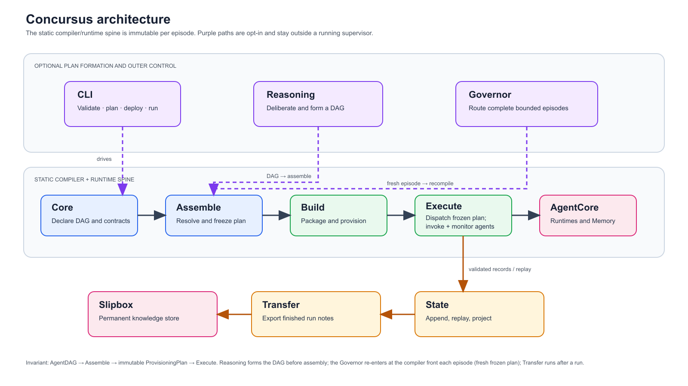

# Concursus

[](https://opensource.org/licenses/MIT)
[](https://www.python.org/downloads/)

**Compile a declarative DAG of subagents into a deployed, orchestrated team on AWS Bedrock AgentCore.**

Concursus (Latin *"a running-together / convergence"*) is [cursus](https://github.com/TianpeiLuke/cursus)'s agent-orchestration sibling. Where cursus compiles a pipeline DAG + configs into a SageMaker pipeline, Concursus compiles an **AgentDAG** + per-agent `.agent.yaml` manifests into (1) an AgentCore **provisioning plan** — one `CreateAgentRuntime` per agent — and (2) a **supervisor** that dispatches the agents in topological order, wires each agent's declared output into its dependents' input, and routes shared state through AgentCore **Memory**.

It is the **coordinator AgentCore deliberately doesn't ship**: AgentCore gives you transport (A2A), tool discovery (Gateway), microVM isolation, identity, memory, and hosting — but no scheduler, dependency graph, or supervisor. You declare a DAG of agents; Concursus provisions them and runs them.

> **Status: alpha.** This release ships the **declarative core** (`AgentDAG` + `AgentManifest`) **and the offline compiler**: the dependency resolver, the runtime builder, the `OrchestrationAssembler` (DAG + manifests → a `ProvisioningPlan`), and the topological `Supervisor` — plus the `plan` / `deploy` / `run` CLI verbs. The compiler is pure-Python; boto3 stays behind the `[agentcore]` extra and is imported lazily only when `deploy --execute` / `run --execute` actually calls AWS.

## System architecture



The architecture has one immutable inner path — `AgentDAG + manifests → assemble → ProvisioningPlan → Supervisor.run` — with durable state alongside it. The optional reasoning tier forms a DAG *before* compilation; the optional governor creates fresh plans only *between* complete execution episodes. See the [comprehensive module map and relationship analysis](docs/architecture.md), or the [scalable SVG diagram](docs/assets/system-architecture.svg) for a vector version.

---

## Installation

```bash
pip install concursus                 # declarative core (pure Python)
pip install "concursus[agentcore]"    # + boto3: the AWS Bedrock AgentCore runtime binding (deploy + the `agentcore` invoke backend)
```

Requires **Python 3.10+**.

## Quick start

Declare a team as an `AgentDAG` (nodes = agents, edges = data dependencies):

```python
from concursus import AgentDAG

dag = AgentDAG()
for agent in ["ingest", "summarize", "critique", "format"]:
    dag.add_node(agent)
dag.add_edge("ingest", "summarize")
dag.add_edge("summarize", "critique")
dag.add_edge("critique", "format")

dag.topological_sort()   # ['ingest', 'summarize', 'critique', 'format']  <- dispatch order
dag.validate()           # raises if the topology has a cycle
```

Describe each agent with an `.agent.yaml` manifest — its AgentCore binding + typed interface:

```yaml
# summarize.agent.yaml
registry:
  container_uri: 111122223333.dkr.ecr.us-east-1.amazonaws.com/summarize-agent:latest
  role_arn: arn:aws:iam::111122223333:role/ConcursusAgentRuntimeRole
  network_mode: PUBLIC       # or VPC
  protocol: HTTP             # HTTP (/invocations) | MCP (/mcp) | A2A (/)
  qualifier: DEFAULT
  # ...or reuse an already-deployed agent:
  # agent_runtime_arn: arn:aws:bedrock-agentcore:us-east-1:111122223333:runtime/summarize-xyz
contract:
  inputs:
    document: {type: string}
  outputs:                   # required — the dependency resolver's type gate
    summary: {type: string}
    key_points: {type: array, items: {type: string}}
spec:
  depends_on:
    - {from: ingest.document, to: document}
```

```python
from concursus import AgentManifest

m = AgentManifest.from_yaml("summarize.agent.yaml").validate()
m.protocol        # 'HTTP'
m.output_schema   # {'summary': {...}, 'key_points': {...}}
```

Or from the CLI:

```bash
concursus info                        # overview
concursus validate *.agent.yaml       # validate manifests
concursus --version
```

## Compile a plan (`plan` → `deploy` → `run`)

Point the compiler at your manifests. Edges are inferred from each manifest's `depends_on`
(or pass `--dag ingest->summarize` to set them explicitly). `plan` prints a JSON
`ProvisioningPlan` — a topological `order`, one `create_agent_runtime` entry per agent, and
the resolved producer→consumer `wiring` — without touching AWS:

```bash
concursus plan *.agent.yaml
```

```python
from concursus import AgentDAG, AgentManifest, OrchestrationAssembler, Supervisor

manifests = {m.name: m for m in map(AgentManifest.from_yaml, paths)}
dag = AgentDAG()
for name in manifests:
    dag.add_node(name)
dag.add_edge("ingest", "summarize").add_edge("summarize", "critique")

plan = OrchestrationAssembler(account="111122223333", region="us-east-1").assemble(dag, manifests)
plan.order           # ['ingest', 'summarize', 'critique']  <- dispatch order
plan.to_dict()       # JSON-serializable preview (what `concursus plan` prints)
```

`deploy` dry-runs what *would* be created (nothing imported); `--execute` provisions each agent
end-to-end — ensure its IAM execution role, build + push its image to ECR (when the plan carries a
placeholder URI), then `CreateAgentRuntime` — reusing an existing image or runtime ARN as-is. `run`
dry-runs the topological dispatch; `--execute` invokes the live runtimes, threading each output
into its dependents:

```bash
concursus deploy *.agent.yaml                          # dry-run: the role/image/create steps
concursus deploy *.agent.yaml --execute --source-dir . # + boto3 + docker: role → ECR image → create
concursus run    *.agent.yaml --inputs '{"uri": "s3://doc"}'            # dry-run the dispatch
concursus run    *.agent.yaml --inputs @inputs.json --execute          # live InvokeAgentRuntime
```

```python
outputs = Supervisor(plan, manifests).run({"uri": "s3://doc"})   # {node_id: output_dict}
```

## How it works (the compile target)

Concursus compiles `AgentDAG + manifests` through `validate → resolve → provision → assemble`, mapping cursus concepts onto AgentCore primitives:

| cursus | Concursus | AgentCore primitive |
|---|---|---|
| `PipelineDAG` | `AgentDAG` | dispatch order (topological) |
| `.step.yaml` | `.agent.yaml` manifest | container image + `roleArn` + protocol |
| `DependencyType` enum | output **JSON Schema** (mandatory) | the resolver's type gate |
| `PropertyReference` (deferred) | `AgentRef` (eager JSONPath) | `InvokeAgentRuntime` response |
| step registration | agent registration | `CreateAgentRuntime` → ARN + V1 + `DEFAULT` endpoint |
| `PipelineAssembler` → `Pipeline` | `OrchestrationAssembler` → supervisor + plan | `BedrockAgentCoreApp` supervisor |
| S3 artifact channels | shared run state | **AgentCore Memory** |

The supervisor dispatches agents in topological order, invokes each with `InvokeAgentRuntime` under one `runtimeSessionId` (session affinity → warm microVMs), extracts each producer's output by JSONPath and injects it into its consumers, and persists outputs to Memory so state survives the ephemeral microVMs.

## Durable run state (the `StateStore` seam)

The supervisor threads every output through a **`StateStore`** — an append-only log of validated
outputs plus a derived `{node: output}` projection (the slipbox's single-source-of-truth /
derived-DB discipline). Three backends share one Protocol:

- **`InProcessStateStore`** — the zero-dependency, offline default. Nothing new to install.
- **`MemoryStateStore`** — opt-in, AgentCore **Memory**-backed. Each validated output is one Blob
  event; a run **resumes by replaying** its event log, so it survives micro-VM teardown / mid-run
  crashes — the supervisor skips any node already `completed()`. boto3 is imported lazily (the
  `[agentcore]` extra); pass `run --memory-id <id> [--actor-id <id>] --execute`. For long-lived /
  standing loops, an optional **`checkpoint()`** compacts the log so a warm resume reads only
  **O(events-since-the-last-checkpoint)** (a `CHECKPOINT` snapshot event + an `epoch` tag, resumed
  via bounded `EQUALS_TO` filters) instead of the whole session; the log stays the source of truth
  and resume falls back to the full rebuild when no checkpoint is present.
- **`FileVaultStateStore`** — opt-in, **persistent on-disk** (no AWS). Each record is written as a
  **round-trip-exact markdown note** under `<vault>/runs/<session>/` (two authoritative base64 JSON
  blobs — `meta` + `payload` — are the source of truth; everything else is a greppable display
  copy), so a run is durable and inspectable offline and **resumes by reloading** the notes. Notes
  are **slipbox-conformant** by default (P.A.R.A. tags, a derived `building_block`,
  `folgezettel`/`lineage` forming a per-run trail, a typed H1, a `## Related Notes` section) — they
  validate under `check_note_format.py` and read as a genuine slipbox trail; `slipbox_form=False`
  gives a lean machine schema. `concursus.build_run_db`
  materializes a **derived, gitignored SQLite** graph/index over the notes (metadata postings,
  `consumes` edges, the execution-address tree, a latest-validated projection view) — the notes
  stay canonical, the DB is disposable. Pure stdlib; pass `run --vault <dir> --execute`.

Each record also persists its resolved `AgentRef` edges (`consumes`), turning the log into a
**queryable run graph** (`RunGraph`: `upstream`/`downstream`, a structural `validate`, bounded
`context_order`). `Supervisor.context(node)` returns a node's transitive upstream outputs — shared
context as a query, not point-to-point wiring:

```python
from concursus import Supervisor, InProcessStateStore

sup = Supervisor(plan, manifests, state_store=InProcessStateStore())
outputs = sup.run({"uri": "s3://doc"})   # {node_id: output_dict}
sup.context("critique")                  # {producer: output} for its transitive upstream
```

### Session-end knowledge transfer (opt-in egress)

Those run notes are **episodic** — they live in the run's own `<vault>/runs/<session>/` and die with
it. The **`concursus.state.transfer`** connector is the opt-in egress that flows a finished
session's episodic memory *out* into a **permanent** external Slipbox via a knowledge-consolidation
sub-agent. Four pieces, all compile-time or strictly-outer (never an in-`Supervisor.run` mutation):

- **the `slipbox_transfer` terminal node** — `build_slipbox_transfer_manifest` +
  `wire_slipbox_transfer_terminal` author an MCP node wired as the run's sole sink, with a
  **fail-closed acceptance contract** (`state` must be `complete`, `result_path` non-empty) that
  mirrors the consolidation sub-agent's real job dict; `slipbox_transfer_acceptance_fn` narrows the
  `Supervisor`'s opt-in `check_acceptance` gate to just this node.
- **registration** — `register_slipbox_foundry` seeds the `AgentRegistry` + `DeployLedger` so
  `match_task("slipbox_transfer")` resolves the standing sub-agent.
- **the export** — `export_run_log` copies the run's episodic notes (byte-identical, idempotent,
  inode-stable) into the sub-agent's local ingestion inbox; `distill_export` wires the cross-run
  precedent. Ingestion is an **injected** `admit_fn` (default a pure file-drop) — concursus never
  imports the consolidation runtime.
- **the trigger** — `TransferTriggerSink` (composed with a phase sink via `FanOutEventSink`) fires
  the export at the strictly-outer `decision` / `route=="synthesize"` boundary;
  `sweep_untransferred_runs` is the reaper / next-boot backstop; a `.slipbox_transferred` marker
  makes at-least-once converge to exactly-once. `session_overall_ok` is the rollup: a session is not
  green unless the transfer ran and was accepted.

Import from `concursus.state.transfer` (and `FanOutEventSink` from `concursus.governor`). Wire none
of it and the run is byte-for-byte unchanged. See the full guide:
[docs/guides/knowledge-transfer.md](docs/guides/knowledge-transfer.md).

## The governor (opt-in dynamic outer loop)

The compiler and supervisor are **static**: `assemble` freezes one `ProvisioningPlan` and
`Supervisor.run` executes it in a single forward pass. When you want a *dynamic* control loop —
standing "keep-the-lights-on" monitoring, replan-on-signal, program/portfolio rollups — the
**`governor`** subpackage wraps a **bounded cycle around** the compiler. The design is a **dynamic
outer loop hosting freeze inner episodes**: each round the governor forms a *fresh frozen plan* at
the compiler front and dispatches *one* new bounded `Supervisor.run` episode. It never reaches
inside a running supervisor, never mutates a frozen plan, and never turns the compiler into a
runtime governor — the compiler-not-runtime-governor identity holds.

**It is entirely opt-in.** The zero-config path stays static `assemble` → `Supervisor.run`; you
reach for the governor only when you want the cyclic driver. Like the reasoning tier, **LangGraph
stays optional** — the loop mirrors the `DKSEngine` template (lazy import, pure-Python fallback), so
everything imports and runs with no langgraph installed.

```python
from concursus import GovernorLoop

# A bounded cycle: planner (assemble/recompile) -> router -> run_episode (one Supervisor.run)
# -> collect -> {replan | synthesize}. Terminates on frontier-exhaustion / stall / max_rounds
# / a hard step_cap. backend="auto" uses LangGraph if present, else the pure-Python driver.
loop = GovernorLoop(goal="triage-abuse-signal", manifests=manifests, max_rounds=8)
result = loop.run({"uri": "s3://signal"})   # GovernorResult: plan sequence + folded episode log
```

The subpackage is layered strictly outside the compiler (identity invariants INV-1..INV-5):

- **`GovernorState`** — persistent outer-loop state: the *sequence* of frozen plan VALUEs by
  `plan_version` + a pointer to the append-only `StateStore` log (the sole executed-prefix anchor),
  never a mutable compiler plan.
- **`GovernorLoop`** — the fixed cyclic driver. `planner` forms a fresh frozen plan each round
  (first via `plan_from_goal` + `assemble`, later via monotonic `recompile`); `run_episode` calls
  `Supervisor.run` once; `collect` folds outputs into the log and re-derives the executed prefix
  from `store.completed()`. Durable dual resume (outer `plan_version` checkpoint + inner log replay)
  when backed by a `MemoryStateStore`.
- **`TrustLadderScheduler`** — the `router`'s per-decision matcher: matches each ready step to a
  standing agent (read-only `AgentRegistry`), reads its *earned* trust, and proposes a frontier
  (`DISPATCH` / `ESCALATE` L1→L3 / `UNMATCHED`) that feeds the *next* `recompile` — never mutating a
  frozen plan.
- **`AgentRegistry`** — the governor's process table: a read-only versioned view over the shipped
  `DeployLedger` answering *"which standing agent, at which version, can do task X?"* (the ledger
  answers content-identity only). Spawn/fork delegate to the shipped `provision_agent`.
- **`DirectorCockpit`** — a read-only director view composing a briefing, an exception queue, and a
  runs monitor purely out of `render_precedent_hub` + `Supervisor.summary()`/`.index()`.
- **`KTLODaemon`** — a standing monitor above the loop (`monitor → triage → escalate → replan |
  close`) that wakes on a live `EventSource` + drift and dispatches one fresh bounded episode per
  investigation. `LAUNCH` (one-shot drain) vs `KTLO` (standing, `max_ticks`-bounded) is a config,
  not two code paths.
- **`scope`** — the `org → portfolio → program → task` layer above the single run: a `ScopeAddress`
  stack, a cross-program programs index (the program-grain analogue of the runs-grain precedent
  hub), and a 1:N `director_leverage_view` — all read-only projections over the per-run precedent
  notes.

These modules are now **wired into the loop** behind opt-in seams (identity-preserving; the
default `GovernorLoop(...)` with no `scheduler=` and `deliberate=False` is byte-for-byte today's
behavior):

- **`router` gates the frontier by earned trust** — pass `scheduler=TrustLadderScheduler(...)` and
  each round `router` holds below-bar (`ESCALATE`) and no-agent (`UNMATCHED`) nodes out of the
  episode via the `Supervisor`'s opt-in `held` skip param — a pure non-dispatch that never mutates
  the frozen `plan.order` (the held node stays in the open frontier for a later round). Held nodes
  surface on `GovernorResult.escalated` / `.unmatched`.
- **`collect` re-earns trust GOV-side** — with a scheduler wired, each node re-earns its grade via
  `update_trust` the round it first completes (keyed by matched agent name); the only place earned
  trust moves across episodes, never in the compiler, never per-invocation.
- **`planner` can deliberate before freezing** — pass `deliberate=True` to author round-1's DAG via
  the bounded `form_plan` deliberation (adjust → converge → lower to a frozen `AgentDAG`) strictly
  *before* `assemble`; later rounds still use `recompile`. Defaults to deterministic stubs — no LLM.
- **live read-only cockpit / scope** — `loop.cockpit()`, `loop.programs_index(vault)`, and
  `loop.leverage_view(vault)` render the `DirectorCockpit` / `scope` projections over the loop's own
  log and final frozen plan — pure reads that dispatch nothing.

The scheduler/deliberation seams also thread up through the **standing daemon** and out to the
**cockpit** (opt-in; the default `KTLODaemon(...)` with no `scheduler=` and `deliberate=False` is
byte-for-byte today's plain episode):

- **the `KTLODaemon` can spawn governed episodes** — pass `scheduler=TrustLadderScheduler(...)`
  (and/or `deliberate=True`) and the daemon forwards them into each fresh bounded `GovernorLoop` it
  enqueues per triggered investigation, so a keep-the-lights-on run is trust-gated and can deliberate
  before freezing. The daemon still only *enqueues* fresh loops over fresh stores and holds no
  mutable plan (INV-1/INV-4).
- **the cockpit surfaces the governance holds** — `DirectorCockpit.exception_queue()` now folds the
  last episode's below-bar `ESCALATE` and no-standing-agent `UNMATCHED` holds in alongside the
  failed-node rows (threaded through `loop.cockpit()`), so a held frontier is operator-visible, not
  just failures — still a pure read that dispatches nothing.
- **an unmatched-node stall is named** — when a governed loop can make no further progress solely
  because every remaining open-frontier node is `UNMATCHED`, `GovernorResult.terminated_by` reports
  the distinct `unmatched_stall` label instead of a generic stall, so the terminal cause is explicit.

Two shipped-but-idle core seams are now wired into the dispatch path (**C-3**, identity-preserving):
the `Supervisor` constructor runs the shipped `RunGraph.validate()` **once** as a pre-dispatch
structural gate (a dangling `AgentRef` or cycle is rejected before the first invoke; `run()` stays a
single static pass), and `MemoryStateStore.replay()` is documented as a full cold rebuild — the
INV-5-correct choice, since AgentCore's `nextToken` is an opaque pagination cursor, not an
events-after filter.

## Roadmap

- [x] Declarative core: `AgentDAG` + `AgentManifest` (`.agent.yaml`) + validation + CLI
- [x] Dependency resolver over declared output JSON Schemas (`AgentRef` wiring + type-gating)
- [x] `OrchestrationAssembler`: emit an AgentCore provisioning plan (`CreateAgentRuntime` per agent + synthesized IAM roles + endpoints)
- [x] The supervisor: topological dispatch over `InvokeAgentRuntime` with `AgentRef` wiring + one stable `runtimeSessionId`
- [x] `plan` / `deploy` / `run` CLI verbs (deploy/run `--execute` bind boto3 lazily)
- [x] Memory-backed shared run state (the `StateStore` seam: in-process default / AgentCore Memory opt-in, replay-resume, the AgentRef link graph + `context(node)`)
- [x] The governor: an opt-in dynamic outer loop (`GovernorLoop` / `TrustLadderScheduler` / `AgentRegistry` / `DirectorCockpit` / `KTLODaemon` / `scope`) that drives the freeze compiler as bounded episodes (LangGraph optional)
- [x] Session-end knowledge transfer: the opt-in `state.transfer` connector (the `slipbox_transfer` terminal node + fail-closed acceptance gate, the episodic-log export, the strictly-outer `synthesize` trigger + reaper backstop, and the transfer-inclusive `session_overall_ok` rollup)
- [x] The execute runtime stack: invoke real leaf agents — `AgentInvoker` (dispatch by `manifest.runtime.backend`: `callable` / `agentcore` `InvokeAgent` / `http` SSE / `strands`, with `api` a declared stub) + a rule-based per-node `ExecutionMonitor` over its live `LogEvent` stream + the `AgentHarness` wrapper (I/O, contract enforcement, monitor wiring, bounded retry) + `FileStore`/`S3Store` artifacts + futility cancellation, all plugged into the Supervisor's `NodeExecutor` seam (opt-in: a run that wires no harness factory is byte-for-byte unchanged)
- [ ] Gateway/A2A node types; a data-driven catalog + recommender of team topologies

## License

MIT © Tianpei Xie
