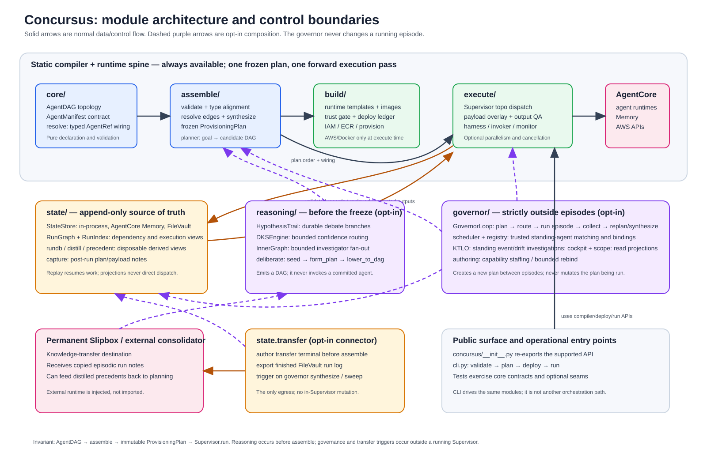

# System architecture



Concursus is a declarative agent-team compiler. Its primary path is deliberately narrow:

```text
AgentDAG + AgentManifest set → OrchestrationAssembler → immutable ProvisioningPlan → Supervisor.run
```

`Supervisor.run` makes one topological forward pass. Planning, reasoning, and governance are intentionally kept outside that pass. This is not merely a documentation convention: the module imports, data types, and control flow enforce it. The table and diagram below summarize the result of a source review of every production package.

## Module map

| Module | Responsibilities | Depends on / produces |
|---|---|---|
| `core` | Defines `AgentDAG`, typed `AgentManifest`, JSON-path `AgentRef`, and alignment/type checks. | The declaration foundation. `manifest` uses build trust types; `resolve` turns manifest `depends_on` declarations into resolved wiring. |
| `assemble` | Validates a DAG/manifests, resolves their wiring, synthesizes build entries, and freezes a `ProvisioningPlan`. `planner` can create a candidate DAG from a goal. | Consumes `core`; consumes `build.RuntimeBuilderFactory`; produces the shared plan consumed by deployment and execution. |
| `build` | Renders runtime/container/IAM artifacts, applies trust gates, records content-addressed deployment history, and optionally provisions AWS resources. | Consumes manifests and assembled entries. `provision` is the AWS/Docker boundary; `ledger` is later read by governor registry. |
| `execute` | Executes a frozen plan: `Supervisor` overlays `AgentRef` outputs onto inputs, invokes nodes, validates results, and records them. Optional harnesses add backends, monitoring, artifacts, retries, parallel waves, and futility cancellation. | Consumes `assemble.ProvisioningPlan`, `core.resolve`, and `state`. It uses the `build` result indirectly through plan entries/ARNs, rather than recompiling. |
| `state` | Provides the append-only `StateStore` contract and in-process, AgentCore Memory, and FileVault backends. It derives run graph/index, SQLite, capture notes, precedents, and transfer helpers. | Receives execution records. `RunGraph`, `RunIndex`, `rundb`, distillation, and precedent retrieval are rebuildable read models; they do not schedule work. |
| `reasoning` | Runs bounded hypothesis deliberation (`HypothesisTrail`, `DKSEngine`, `InnerGraph`) and lowers only a converged result to an `AgentDAG`. | Reads/writes its deliberation trail and can use state precedents/FileVault. Its output feeds `assemble`; it never calls `Supervisor.run`. |
| `governor` | Hosts a bounded outer loop, trust-aware scheduling, a deployment-derived registry, authoring/rebinding, KTLO monitoring, and read-only cockpit/scope views. | Uses `assemble` to create a fresh plan and `execute` for one episode; uses `state` for the executed-prefix/log. `scheduler` reads `build` trust and registry; `registry` reads the deploy ledger. |
| `state.transfer` | Optional session-end knowledge-transfer connector: authors an ordinary terminal node before assemble, exports completed episodic notes, and triggers only at an outer governor boundary or recovery sweep. | Bridges FileVault/distilled precedent material to an injected external consolidator. It does not alter `Supervisor.run`. |
| Package root and `cli` | Re-export the public API and expose `validate`, `plan`, `deploy`, and `run`. | Both are thin entry points over the same compiler/deploy/execution modules. |

## File-level inventory

This is the finer-grained source inventory behind the package map. `__init__.py` files are intentionally omitted below: they are export surfaces, except the root package initializer, which also defines the public API.

| Package | Files and roles |
|---|---|
| Root | `__init__.py` re-exports the supported API; `cli.py` parses commands and delegates to manifest loading, assembly, provision, and supervision. |
| `core` | `dag.py` owns deterministic topology and cycle analysis; `manifest.py` parses/validates agent hosting, contract, runtime, and capability declarations; `resolve.py` extracts JSON paths, builds `AgentRef`s, and enforces edge/capability alignment. |
| `assemble` | `assemble.py` defines `ProvisioningPlan`, freezes DAG/manifests, supports bounded monotonic recompilation, and authors optional plan annotations; `planner.py` turns a goal/model response/precedent stages into a valid candidate DAG. |
| `build` | `build.py` renders protocol-specific runtime wrappers, Dockerfiles, IAM requests, fingerprints, and `BuildPlanEntry`s; `provision.py` performs optional role/ECR/image/runtime creation and reservation reconciliation; `ledger.py` is the append-only deployment identity/history store; `trust.py` defines trust grades and deployment decisions. |
| `execute` | `types.py` carries invoke/log/health values; `invoker.py` dispatches callable, AgentCore, HTTP, Strands, or declared API backends; `monitor.py` evaluates streamed health signals; `harness.py` adds artifact I/O, monitor, contracts, and retries; `harness_factory.py` adapts manifests to supervisor node executors; `object_store.py` supplies local/S3 artifacts; `futility.py` computes and signals safe in-flight cancellation; `supervisor.py` runs the immutable plan, validates outputs, and records state. |
| `state` | `statestore.py` defines append-only records, event vocabulary, indexing, and in-process/Memory backends; `filevault.py` persists inspectable Markdown records and version history; `capture.py` writes post-run plan/payload notes; `rungraph.py` derives producer/consumer reachability; `runindex.py` derives metadata and execution-tree indexes; `rundb.py` builds disposable SQLite/FTS projections; `distill.py` produces durable precedent notes/hubs; `precedent.py` retrieves/ranks precedents; `transfer.py` implements opt-in terminal-node authoring and finished-run export. |
| `reasoning` | `trailstore.py` persists hypotheses and grounded-semantics resolution; `dks_engine.py` runs bounded confidence/coherence deliberation; `inner_graph.py` batches and dispatches hypothesis investigators; `deliberate.py` orchestrates seed, convergence, and deterministic DAG lowering. |
| `governor` | `state.py` holds outer-loop values; `loop.py` implements the bounded plan/route/episode/collect cycle; `scheduler.py` applies trust-aware matching, bindings, and payload tiers; `registry.py` derives standing versions from deployment history; `authoring.py` creates/staffs manifests and bounded rebinds; `ktlo.py` runs event/drift investigations and pure culling/admission gates; `cockpit.py` provides read projections plus a scoped control surface; `scope.py` models organization/portfolio/program/task addressing and cross-program views. |

## Why the relationships are directional

The source establishes five important boundaries.

1. `core → assemble → execute` is the main dependency direction. `OrchestrationAssembler.assemble()` validates and resolves before returning a value-type `ProvisioningPlan`; the supervisor reads that value and does not revise it.
2. `build` is split into synthesis and actuation. Assembly asks `RuntimeBuilderFactory` for per-agent entries; actual IAM/ECR/AgentCore work is confined to `build.provision` and reached only by explicit deployment.
3. `execute ↔ state` is a data relationship, not a control loop. Execution appends validated records and can replay completed records to resume. The state package's graphs, indexes, SQLite materializations, precedent hub, and cockpit inputs are derived projections.
4. `reasoning → core/assemble` is strictly pre-compile. Deliberation resolves hypotheses, then emits a DAG for the normal compiler path. It has no dependency on the supervisor.
5. `governor ⟲ compiler/execution` is strictly inter-episode. A `GovernorLoop` may plan, route, run one complete `Supervisor` episode, collect, then form another frozen plan. It does not reach into a running supervisor or mutate an existing plan. The transfer trigger shares this outer-boundary constraint.

## Data and lifecycle flow

1. An author (or optional reasoning front) produces an `AgentDAG` and one `AgentManifest` per node.
2. `assemble` verifies the graph and contracts, turns declared producer fields into `AgentRef` wiring, and creates build/provisioning entries in an immutable plan.
3. A caller may deploy plan entries through the optional AWS actuator. The ledger records deployment identity and supports the governor's standing-agent view.
4. `Supervisor` dispatches plan nodes in topological order, merges run inputs with referenced upstream output, validates output, and appends records to a `StateStore`.
5. State backends make replay/resume possible; their derived indexes and distilled precedent material can inform future planning without changing the current run.
6. When enabled, the governor starts a new bounded episode around this lifecycle. When enabled, transfer exports the finished episodic run at an outer boundary to an external knowledge-consolidation workflow.

## Diagram legend

- Solid arrows: the normal compiler, deployment, execution, and state data/control paths.
- Amber arrows: append/replay relationships with durable state.
- Dashed purple arrows: opt-in composition points and outer-loop relationships.
- Pink boxes: AWS services or an external Slipbox/consolidator, which are outside the package's core execution logic.

The diagram is maintained as SVG at [`assets/system-architecture.svg`](assets/system-architecture.svg), with a PNG rendering alongside it for contexts that cannot render SVG.
