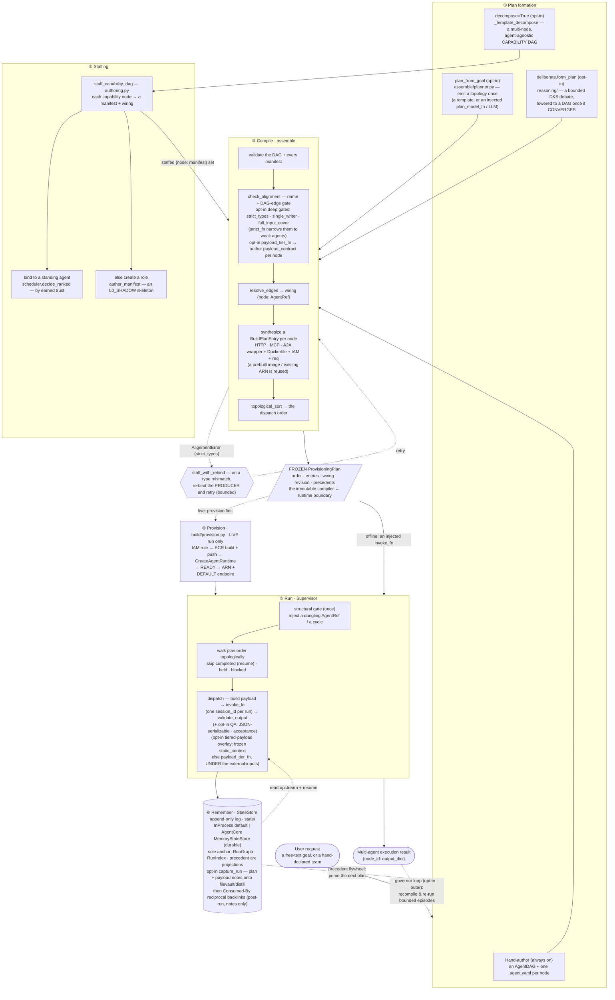

# Overview

*What Concursus is, the problem it solves, and the mental model to hold in your head before you read anything else.*

Concursus (`concursus`, import name `concursus`; Latin *"a running-together / convergence"*) compiles a declared team of agents into a deployed, orchestrated run on AWS Bedrock AgentCore. This page orients you: the gap it fills, the one-line pitch, and the three layers — a static compiler+runtime, an opt-in reasoning front, and a strictly-outer governor loop — that everything else in these docs hangs off. Read it first, then move on to [Getting Started](getting-started.md) and [Core Concepts](concepts.md).

---

## The problem: AgentCore ships everything but the coordinator

AWS Bedrock AgentCore gives you the hard primitives for running one agent well: **transport** (A2A), **tool discovery** (Gateway), **microVM isolation**, **identity**, **memory**, and **hosting**. What it deliberately does *not* ship is the thing that turns several agents into a *team*:

- no **scheduler** — nothing decides what runs when;
- no **dependency graph** — nothing knows that the critic needs the summarizer's output first;
- no **supervisor** — nothing dispatches agents in order, wires each one's output into its dependents' inputs, and threads shared state across the ephemeral microVMs.

Concursus *is* that missing coordinator. You declare a DAG of agents plus a typed `.agent.yaml` manifest per agent; Concursus provisions them (one `CreateAgentRuntime` each) and runs them in topological order, wiring outputs to inputs and persisting run state so it survives microVM teardown.

## The one-line pitch

> **Compile a declarative DAG of subagents into a deployed, orchestrated team on AWS Bedrock AgentCore — with an optional reasoning tier that can *form* the plan by deliberation before it compiles, and an optional governor that runs the whole thing as bounded, governed episodes.**

## The mental model: three layers

Hold three layers in your head. Only the first is always on; the other two are opt-in and wrap around it.

### 1. The static compiler + runtime (always on)

The spine. Pure-Python (plus PyYAML); AWS is lazy and optional. It carries a declared team through five stages:

| Stage | Folder | What happens |
|---|---|---|
| **declare** | [`core/`](../src/concursus/core/dag.py) | `AgentDAG` topology + `AgentManifest` (`.agent.yaml`); `resolve` type-gates `depends_on` edges against the mandatory output JSON Schema. |
| **compile** | [`assemble/`](../src/concursus/assemble/assemble.py) | `OrchestrationAssembler.assemble` validates, wires, and **freezes** the DAG + manifests into a `ProvisioningPlan`. |
| **provision** | [`build/`](../src/concursus/build/build.py) | Synthesize per-agent artifacts (wrapper, Dockerfile, IAM role); the one AWS+Docker actuator does IAM → ECR → `CreateAgentRuntime`. |
| **run** | [`execute/`](../src/concursus/execute/supervisor.py) | `Supervisor.run` walks `plan.order` once, invoking each agent under one `runtimeSessionId`, overlaying resolved upstream outputs. |
| **remember** | [`state/`](../src/concursus/state/statestore.py) | Every output threads a `StateStore` append-only log; `RunGraph`, `RunIndex`, SQLite, and the precedent store are disposable projections over it. An opt-in **capture front** ([`state/capture.py`](../src/concursus/state/capture.py)) runs post-run: `capture_run` persists the frozen plan + each invoke payload as notes onto the shipped `filevault`/`distill` writers (concursus's own `<run_dir>` memory), then adds reciprocal `## Consumed By` backlinks. |

The **run** stage has two registers. By default `Supervisor.run` is a pure dispatcher: you inject a single `invoke_fn` transport and it walks `plan.order` once, overlaying each agent's resolved upstream outputs onto its payload under one `runtimeSessionId` — the offline, AWS-free path these docs lead with, and it is unchanged. Layered *inside* that same governed dispatch seam (the Supervisor's `NodeExecutor` slot) is an **opt-in runtime stack** that invokes *real* leaf agents and watches them as they run: an `AgentInvoker` dispatches by `manifest.runtime.backend` — `callable` (an in-process entrypoint), `agentcore` (Bedrock `InvokeAgent`), `http`, and `strands` (a fifth, `api`, is a declared stub) — and its `invoke_with_tap` returns the response plus a live `LogEvent` stream; an `ExecutionMonitor` reads that stream for rule-based per-node health (idle-timeout / error-threshold / tool-loop / token-budget) and can raise a `PreemptiveTermination` carrying a corrective-retry amendment; an `AgentHarness` wraps each node with I/O, contract enforcement, monitor wiring, and bounded retry; artifacts land in a `FileStore`/`S3Store`; and the Supervisor's opt-in `cancel_futile` prunes work that can no longer change the outcome. It is all **default-off**: wire no harness factory and none of it runs — the default `invoke_fn` pass is **byte-for-byte unchanged** — and even wired, the stack lives entirely *inside* the frozen-plan dispatch, never mutating a plan, so Concursus stays a compiler, not a runtime governor. Per-symbol detail lives in [Compiling & Running a Team](guides/compiling-and-running.md) and the [`execute` reference](reference/execute.md).

The **capture front** is a thin, source-agnostic dispatcher — `capture_run(run_dir, plan=…, payloads=…)` maps a `CaptureEnvelope` (`adapt_plan` / `adapt_payload`) onto the already-shipped `filevault`/`distill` writers; it is **not** a new runtime and grows no LangGraph. It is pure post-run: it writes *notes*, never run records (a payload note is stamped `concursus_note_kind: payload` so replay refuses it), redacts PII before writing, and its `add_reciprocal_backlinks` pass merely projects a `## Consumed By` section onto producer notes over edges already recorded. The **payload contract** is the compile-time counterpart: `ProvisioningPlan.payload_contract` carries, per node, a `{trust_tier, static_context}` entry that a compiler *authors* and capture *persists* — when `payloads` is omitted, `capture_run` derives them from that frozen contract. Both are opt-in and default byte-for-byte unchanged.

Those run notes are **episodic** — they live in the run's own `<run_dir>` and die with it. An opt-in **two-tier** memory closes the loop: the [`state/transfer.py`](../src/concursus/state/transfer.py) connector is the egress that flows a finished session's episodic memory *out* into a **permanent** external Slipbox via a knowledge-consolidation sub-agent. The `slipbox_transfer` terminal node (authored *strictly before* `assemble`, with a fail-closed acceptance gate) makes the transfer mandatory; its `TransferTriggerSink` fires the export *strictly OUTER* — at the governor's `synthesize` boundary, never inside a running `Supervisor`. Pure post-run, notes-not-records; wire none of it and the run is byte-for-byte unchanged. See [the opt-in flexibility & robustness layer](#the-opt-in-flexibility--robustness-layer-completed-in-v060) below.

### 2. The reasoning front (opt-in, forms the plan)

Instead of hand-authoring the DAG, you can *deliberate* one. The [`reasoning/`](../src/concursus/reasoning/deliberate.py) tier fans out a tree of hypotheses, converges a bounded debate (routing by a Confidence-Coherence Score), and then **lowers** the converged conclusion into a frozen `AgentDAG` — `seed → form_plan → lower_to_dag`. Crucially, all of this happens **strictly before** compile: it emits a topology and hands it straight to `assemble`. It never dispatches a committed agent and is never wired into a running `Supervisor`. LangGraph is an optional, injected driver; with nothing installed it runs deterministic stubs.

### 3. The governor loop (opt-in, strictly outer)

Standing runtime governance around the compiler. The [`governor/`](../src/concursus/governor/loop.py) tier is a fixed, bounded control loop — *plan → route → run one episode → collect → decide* — that forms a fresh frozen plan each round, runs exactly one `Supervisor` episode over it, folds outputs into the append-only log, then decides (within hard bounds) whether to replan or finish. It matches ready work to standing agents by earned trust, escalates what it cannot clear, and monitors a live event source via the `KTLODaemon`. The feedback edge lives **around** the compiler. Several opt-in gap-fillers (all default-off, so shipped behavior is byte-for-byte unchanged) sharpen this loop: the scheduler can act as a **binder** — ranking the *full* trust-clearing candidate set by trust then availability and returning an explicit `Binding` per ready node; the OS can **create** a net-new role when a frontier capability has no standing agent, authoring a minimal manifest and auto-spawning it at the lowest trust rung so it must earn autonomy before it dispatches side-effecting work; the loop can run **decompose → bind → assemble** as its live round-1 behavior (staffing a capability DAG into a real manifest set with zero hand-authored manifests); and it can thread the router's cleared frontier into the next round's `recompile`, closing the scheduler→compiler channel on the live path. Each of these stays *strictly before* `assemble` and never mutates a frozen plan.

### The load-bearing rule

Everything above obeys one invariant, stated verbatim across the codebase:

> **Concursus is a compiler, not a runtime governor.**

A run is `AgentDAG → assemble → frozen ProvisioningPlan → Supervisor.run` — a single forward pass over an immutable plan. Every generative or mutating step (reasoning, a governor round, `recompile`) happens *strictly before* `assemble`. Resume is a faithful **replay** of an append-only log, never a re-plan mid-flight. The governor loop is strictly **outer**: it never reaches inside a running `Supervisor` and never mutates a frozen plan.

## The layers, at a glance

```
        opt-in                                     opt-in, strictly OUTER
   +------------------+          +=============================================+
   | REASONING FRONT  |          |               GOVERNOR LOOP                 |
   | deliberate a plan|          |  plan -> route -> run_episode -> collect --+ |
   | seed -> DKS ->   |          |    ^   (match ready work by earned trust)  | |
   | lower_to_dag     |          |    +------- replan / synthesize <----------+ |
   +--------+---------+          +==================^==========================+
            |  frozen AgentDAG                      |  each round runs ONE episode
            v                                       |  = one forward pass, then wraps
   ==========================================================================
     STATIC COMPILER + RUNTIME   (always on; pure-Python, AWS optional & lazy)
        declare  ->  compile  ->  provision  ->   run   ->  remember
        core/        assemble/     build/         execute/   state/
   ==========================================================================
```

The reasoning front (when used) emits a frozen DAG into the compiler spine; the governor loop (when used) wraps the spine, running one forward-pass episode per round. Without either, you get the bare spine: declare a DAG, `assemble`, `Supervisor.run`.

## The opt-in flexibility & robustness layer (completed in v0.6.0)

This layer is the **same compiler** — `AgentDAG → assemble → frozen ProvisioningPlan → Supervisor.run`, a single static pass over `plan.order`, resume-by-replay, every generative or mutating step *strictly before* `assemble` — with a set of **opt-in, default-OFF** seams layered over it. Turn none of them on and the shipped behavior is **byte-for-byte unchanged**; each one only *widens* what a caller can ask for or *hardens* a failure path, never relaxes the load-bearing invariant. Grouped by the lens each sharpens:

- **Executor parallelism** ([`execute/`](../src/concursus/execute/supervisor.py), [`reasoning/`](../src/concursus/reasoning/deliberate.py)) — `Supervisor.run(inputs, *, parallel=N)` dispatches each ready **antichain** as a bounded `ThreadPoolExecutor` wave; `parallel=1` (the default) is the exact serial pass, and any `N` is still one static pass over the *frozen* `plan.order` — never a replan, and the store stays byte-identical to serial. The soft `N` is clamped by host CPU via `resolve_ceiling` = `max(1, min(pref, cap))` (hard-capped by `MAX_FANOUT_CAP`). Separately, `unroll_static_fanout(dag, unroll={base: N})` is a *compile-time* rewrite that clones a **declared, data-independent** `N`-way fan-out into `N` frozen branches (`{base}__fe{i}`) plus a `{base}__gather` join, before `assemble` freezes — no runtime graph mutation. An absent/empty `unroll` returns the same DAG object.
- **Durable state** ([`state/`](../src/concursus/state/filevault.py)) — an opt-in append-only note **version timeline** (`FileVaultStateStore(versioned=True)`, plus `append_note_version` / `read_note_versions` / `revert_note`) snapshots each distinct note content into a `versions/` sidecar; revert is *forward-only* (append the prior version as the new head, stamped `reverted_from`), never a history rewrite, and version notes are stamped so a resume/replay skips them. Opt-in **coordination notices** (`append_coordination_notice` / `list_pending_notices`) record a cross-node hint on the same append-only log under a `__coordination__` sentinel with a non-`validated` status, so a notice never enters `completed()` / `get()` / the projection and never triggers dispatch — a passive, staleness-filterable annotation. `get_run_snapshot(run_id, *, agent=, step=)` + `redact_snapshot` add a windowed at-rest read with a redaction egress helper.
- **Governor control + observability** ([`governor/`](../src/concursus/governor/loop.py)) — a pure `IdleRuntimeCuller` *computes* which idle runtimes are eligible to reclaim (two idle floors by tier — long for `standing`, short for `ephemeral` — with an active-guard and wall-clock validation; the teardown stays the caller's). An agent-facing `ControlSurface` gives a governed agent a narrow, in-process handle over the SSOT: read verbs are always on (pure projections), while actuating verbs (deploy / run / recompile) are **absent** unless the compiled `ControlScope` authorizes them, then further gated by an explicit `activate()` and a monotonic `TrustGrade` clamp and routed only through injected existing actuators (with none wired, the surface is fully read-only and offline). And `GovernorLoop(..., episode_gate=…, event_sink=…)` adds an episode-**boundary** approval/interrupt gate (consulted only *between* episodes — it can stop the bounded loop earlier, never reach inside a running `Supervisor`) and a typed `EventSink` that emits a plain-dict `RunEvent` at `episode_start` / `episode_end` / `decision` (the closed `GOV_EVENT_KINDS` vocabulary). The canonical no-op is `NullEventSink`, and `FanOutEventSink` composes several sinks into the one `event_sink` slot, each child individually guarded (an empty fan-out = a no-op = unset). All default to a no-op and return a byte-identical `GovernorResult`.
- **Compiler contract** ([`core/`](../src/concursus/core/manifest.py), [`assemble/`](../src/concursus/assemble/assemble.py)) — the `AgentManifest` gains three optional fields, all inert at their empty defaults: `capabilities` (a typed `AgentCapabilities` of `features` / `tools` / `egress_hosts` the agent's runtime provides), `contract_version` (a fail-closed forward-compat gate, defaulting to `MAX_SUPPORTED_CONTRACT_VERSION`), and `context_mode` (`"reuse"` | `"isolation"` | `""` = inherit, resolved via `resolve_context_mode`). `check_alignment(..., require_capabilities=True)` adds an opt-in compile-time capability gate, a shared typed run-event contract (`RunEvent` / `RunEventKind` / `check_run_event_alignment`) is asserted emitter⇄reader-aligned at build time, and `OrchestrationAssembler.redrive_until_valid` / `retry_budget` provide a **bounded** validate-and-retry helper for a driver *around* the compiler — bounded by the recompile/revision budget and never wired into `assemble` / `recompile` / `Supervisor.run`.
- **Knowledge transfer — episodic → permanent memory** ([`state/transfer.py`](../src/concursus/state/transfer.py)) — the session-end connector that flows a finished run's episodic notes out into a permanent external Slipbox. *(Compile time)* `build_slipbox_transfer_manifest` / `wire_slipbox_transfer_terminal` author a `slipbox_transfer` MCP terminal node — the run's sole sink — with a fail-closed acceptance contract (`state` must be `complete`, `result_path` non-empty) that mirrors the consolidation sub-agent's job dict (its key set is captured in `CONSOLIDATOR_JOB_DICT_KEYS` / `CONSOLIDATOR_COMPLETE_STATE`), and `register_slipbox_foundry` makes it dispatchable; all *strictly before* `assemble`. *(Post-run)* `export_run_log` copies the run's notes (idempotent, inode-stable) into the consolidation sub-agent's ingestion inbox — pure post-run, notes-not-records, never a re-put `Record`; `distill_export` wires the cross-run precedent. *(Strictly OUTER trigger)* `TransferTriggerSink` (composed via `FanOutEventSink`) fires the export at the `decision`/`route=="synthesize"` boundary, and `sweep_untransferred_runs` is the reaper/next-boot backstop — at-least-once → exactly-once via a marker. *(Rollup)* `session_overall_ok` makes the transfer mandatory: a session is not green unless it ran and was accepted. Concursus never imports the consolidation runtime (ingestion is an injected `admit_fn`); wire none of it and the run is byte-for-byte unchanged. See the full guide: [Knowledge Transfer](guides/knowledge-transfer.md).

The default forward pass is untouched: `Supervisor.run` is still a single static topological walk over a frozen plan, resume is still replay, and every generative or mutating seam still sits *strictly before* `assemble` or *around* the compiler in the outer governor loop.

## The pipeline, end to end: from request to multi-agent execution

The ASCII sketch above is the altitude; this flowchart is the detail. It traces a **user request** all the way to a **multi-agent execution result**, naming every intermediate component (a real function/class/module you can open), the action it takes, and how the steps connect. The **spine** — declare/plan → **compile** → run → remember — is always on and pure-Python. The **plan-formation fronts** (generate, decompose, deliberate), the **staffing** front, **provision**, and the **governor loop** are all opt-in and default-off, so the always-on forward pass is byte-for-byte unchanged whether or not they are used.



**How to read it**

- **Solid arrows** are the always-on path; **dotted arrows** are opt-in or feedback edges.
- **A request enters through exactly one front** (stage 1): hand-author a DAG, or let `plan_from_goal` generate one (optionally `decompose`-ing a goal into a capability DAG, or `deliberate`-ing one). Everything before `assemble` is plan *formation*; the compiler never selects agents at run time.
- **Stage 2 only runs on the decompose path**: `staff_capability_dag` turns agent-agnostic capability nodes into real manifests, *binding* each to a standing agent by earned trust (via the scheduler) or *creating* a fresh low-trust skeleton — then `staff_with_rebind` can re-bind on a type-align failure. `staff` emits the manifest set; the scheduler is a seam it calls, not a stage downstream of it.
- **Stage 3 (`assemble`) is the always-on convergence point** and the only place a plan is frozen. The frozen `ProvisioningPlan` is the immutable **compiler ↔ runtime boundary**.
- **Provision (stage 4) is the only step that touches AWS + Docker**, and only for a live run; an offline run injects an `invoke_fn` and skips it.
- **Run (stage 5) is one static topological pass**; `remember` (stage 6) threads every output into the append-only log, which is the sole structural anchor and the substrate for **resume** (a completed node is skipped on replay).
- **The two dotted feedback edges close the loops that make it compounding and governed**: the *precedent flywheel* primes future plans from prior runs, and the *governor loop* wraps the whole spine — running one bounded episode per round, re-earning trust, and `recompile`-ing a fresh monotonic-superset plan — strictly *outside* any frozen plan (it never mutates one and never reaches inside a running `Supervisor`).

## Background: the OPC operating model

Concursus is the runnable substrate behind the *One-Person-Company (OPC)* operating-model thesis: rebuild each business function as a **persistent agent crew** run by a single human acting as *director*, not operator — so routine execution runs at agent speed and coordination cost collapses. The model names three capabilities: **Govern** (an agentic OS — scheduler + memory manager + registry, *not* a planner), **Connect** (typed retrieval over shared operational memory), and **Create** (crews that stand up new programs). This package is the general-purpose orchestration engine distilled from that thesis: the piece that turns a *declared team of agents* into a *provisioned, supervised, memory-backed run*. Opt-in seams (all default-off) map onto those three capabilities: **Govern**'s planner can *decompose* a goal into an agent-agnostic capability DAG rather than a single node, its scheduler *binds* each task to an agent by trust then availability, and its compiler now *enforces and dials a per-agent contract* — deep output-type and single-writer gates that a trust predicate narrows to weak/unproven agents while proven ones stay lean — and can *reject-and-rebind* an unaligned candidate at author time rather than merely validate; **Connect**'s precedent retrieval gains an offline dense rung so a semantically-related-but-lexically-disjoint precedent warms a new run, and the decomposer can *borrow* a related precedent's capability-stage shape to prime a cross-domain plan; and **Create** can author and auto-spawn a net-new role to fill a capability gap. All of these are compile/author-time only and default-off, so the shipped forward pass is unchanged.

The smallest end-to-end slice of the model — *oncall ticket automation* — is what motivates the reasoning tier (let Govern *generate* the plan — fan out hypotheses, converge, then compile) and why durable, replayable state and compounding cross-run precedent are first-class rather than bolt-ons: replaying a burst of manual ticket resolutions to collapse many into a single human decision, using a ticket slipbox as fleet memory, exercises exactly those paths.

## Prior art: how it maps onto cursus

Concursus is the agentic sibling of [cursus](https://github.com/TianpeiLuke/cursus), the system that compiles a pipeline DAG + configs into a SageMaker pipeline. The same compile-a-declared-graph shape, retargeted from SageMaker steps onto AgentCore runtimes:

| cursus | Concursus | AgentCore primitive |
|---|---|---|
| `PipelineDAG` | `AgentDAG` | dispatch order (topological) |
| `.step.yaml` | `.agent.yaml` manifest | container image + `roleArn` + protocol |
| `DependencyType` enum | output **JSON Schema** (mandatory) | the resolver's type gate |
| `PropertyReference` (deferred) | `AgentRef` (eager JSONPath) | `InvokeAgentRuntime` response |
| step registration | agent registration | `CreateAgentRuntime` → ARN + V1 + `DEFAULT` endpoint |
| `PipelineAssembler` → `Pipeline` | `OrchestrationAssembler` → supervisor + plan | `BedrockAgentCoreApp` supervisor |
| S3 artifact channels | shared run state | **AgentCore Memory** |

## Where to go next

- **[Getting Started](getting-started.md)** — install, declare your first team, compile it, and run it (Python API + CLI).
- **[Core Concepts](concepts.md)** — the vocabulary and invariants: DAG, manifest, plan, state, trust, governor, reasoning.
- **Tier guides:**
  - [Authoring Agents (`.agent.yaml`)](guides/authoring-agents.md) — write manifests and satisfy the output-schema type gate.
  - [Compiling & Running a Team](guides/compiling-and-running.md) — resolve → assemble → freeze → supervise, plus `recompile` and `plan_from_goal`.
  - [Durable Run State](guides/durable-state.md) — the `StateStore` seam, three backends, and replay-resume.
  - [The Reasoning Tier](guides/reasoning.md) — form a plan by bounded deliberation, then lower it to a frozen `AgentDAG`.
  - [The Governor](guides/governor.md) — the strictly-outer standing loop: schedule, match by trust, run bounded episodes, escalate.
  - [Knowledge Transfer](guides/knowledge-transfer.md) — the session-end egress of episodic notes into a permanent external Slipbox.
  - [Deploying to AWS Bedrock AgentCore](guides/deploying-to-agentcore.md) — from frozen plan to live runtimes.
  - [Command-Line Interface](guides/cli.md) — `concursus`: `info`, `validate`, `plan`, `deploy`, `run`.
- **API reference:** [core](reference/core.md) · [assemble](reference/assemble.md) · [build](reference/build.md) · [execute](reference/execute.md) · [state](reference/state.md) · [reasoning](reference/reasoning.md) · [governor](reference/governor.md).
- **[Documentation index](README.md)** — the full recommended reading order.
